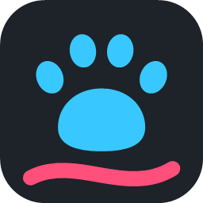

<p align="center"></p>

# Pawboard 🐾

A whiteboard on your Windows desktop. It sits behind your icons as your wallpaper, so you can
scribble notes, lists and doodles right where you'll see them.

Made with Claude (Opus 5.5). I came up with the idea and tested it, Claude wrote the code.

## Download

Grab `Pawboard-0.1.0-win-x64.exe` from [Releases](https://github.com/NeatoPurrito/Pawboard/releases)
and run it. Windows 11, 64-bit.

It isn't code-signed, so Windows will warn you: click **More info → Run anyway**.

To quit, right-click the paw in the tray → **Exit Pawboard**.

## How it works

Pick a tool from the toolbar at the bottom: pen, eraser, text, or the arrow to use your desktop
normally. Scroll to zoom in, middle-drag to move around, right-drag to erase. The ☰ menu has
save/open, dark mode, backgrounds and Start with Windows.

It saves by itself and uses no CPU when you're not drawing.

## Privacy

No internet access at all. To catch clicks on the desktop it watches the mouse, and it only reads
the keyboard while you're typing in one of its text boxes. Nothing you draw or type is logged. Your board is saved in
`%LOCALAPPDATA%\Pawboard`.

## Build it yourself

Needs the [.NET 10 SDK](https://dotnet.microsoft.com/download):

```
git clone https://github.com/NeatoPurrito/Pawboard.git
cd Pawboard/Pawboard
dotnet build -c Release
```

## License

[MIT](LICENSE). Uses [perfect-freehand](https://github.com/steveruizok/perfect-freehand) and
[Vortice](https://github.com/amerkoleci/Vortice.Windows), see [THIRD-PARTY-NOTICES.md](THIRD-PARTY-NOTICES.md).
